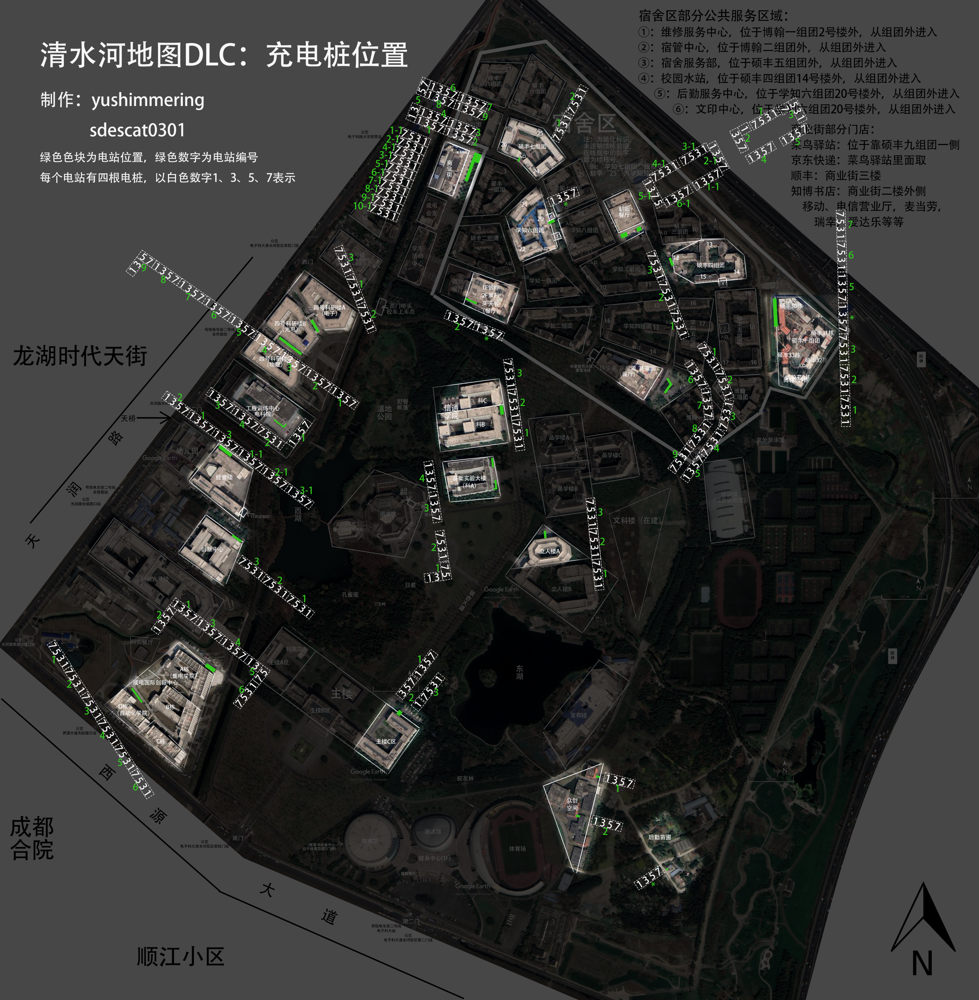

# 电子科技大学充电站空位监控（清水河校区）

纯静态的校园充电站空位监控页面：浏览器直连上游接口取实时数据，本目录整份上传到任意静态托管即可使用，
也可以「添加到主屏幕」当 PWA 用。**仅适配清水河校区**（内置 24 个分区），其它校区未覆盖。

> **地图仅供参考(闪开来电接口返回的定位本身也不准确)。** 页面里的地图、定位、电站标记与实景图站号均为示意，请以现场实际情况为准。

## 功能

- **实时空位**：选分区看实时空位、空闲率与桩位状态（空闲 / 占用 / 故障），默认每 5 秒自动查询，可暂停或立即查询。
- **电站地图**：校园矢量底图 + 定位蓝点 + 电站标记（显示空闲数，点开看详情与地址）。
- **实景图**：一格一个插座，按状态着色，点格看详情；可缩放、拖动，支持指南针模式。
- **PWA / 离线**：可添加到主屏幕，页面外壳离线可开（空位与地图瓦片不进缓存，离线时地图只剩底色）。

## 桩位排布来源

桩位排布与站号抄录自来自 yushimmingering、sdescat0301 的《清水河地图DLC：充电桩位置》：

> ⚠️ **抄录时可能出错，仅供参考。** 站号、位置、每站插座数量都是对着上图手工抄录的，难免有错误。一切以现场实际为准。

## 数据来源

| 内容 | 来源 |
| --- | --- |
| 实时空位 / 桩位状态 | 浏览器直连 闪开来电 服务器 `https://wemp.issks.com`（需上游允许跨域） |
| 校园底图瓦片 | 学校地图服务 `gis.uestc.edu.cn` |
| 桩位排布与站号 | 抄录自上图 |

## 使用与部署

把本目录整份当纯静态站点上传即可，用任意静态服务器托管就行（不能直接双击本地打开，定位、地图与离线能力都需要 http/https）。建议用 https

## 其他须知

- 空位数据依赖上游接口且需跨域可访问，上游不可用即无数据。
- 校园底图瓦片由学校地图服务提供，地址变动会导致地图加载失败。
- 桩位排布与站号抄录自上图，可能有误，仅供参考。
- 仅适配清水河校区。

## 制作

@GZY_mingbai + vibecoding

## 许可协议

本仓库使用 **Unlicense** 授权：代码贡献于公共领域（public domain），任何人可自由使用、复制、修改、
发布、商用或分发，无需署名。协议全文见 <https://unlicense.org>。

注意：本许可只覆盖本仓库自身；页面引用的上游数据、桩位来源图与校方地图瓦片分别归各自权利人所有，不在 Unlicense 范围内，使用前请自行确认授权。
